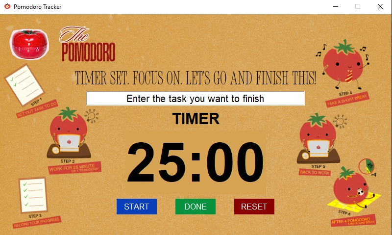

# ⏱️ Pomodoro Tracker (Tkinter GUI)

A simple Pomodoro Timer application built with Python and Tkinter. Designed to help you stay productive by working in focused intervals and taking regular breaks.

> **This project was developed by me for educational and learning purposes.**

---

## 🧠 What is the Pomodoro Technique?

The **Pomodoro Technique** is a time management method where you break work into 25-minute focused intervals (called "Pomodoros") followed by short breaks. This helps reduce mental fatigue and boosts productivity.

---

## 📸 Screenshot



---

## 🚀 Features

- 🖥️ **Modern GUI** using `tkinter`
- 🔔 **Audio notification** at the start and end of work sessions
- 📝 **Task entry field** to stay focused on one goal
- 🎨 Custom fonts and background design
- 🔁 **Start**, **Done**, and **Reset** buttons for control
- 🧠 Supports Pomodoro-style work/break cycles

---

## 🛠️ Technologies Used

- Python 3.x
- `tkinter` (standard with Python)
- `playsound` for audio playback
- Custom assets (images, fonts, sounds)

---

## 📂 Project Structure

```

pomodoro_app/
│
├── assets/
│   ├── images/
│   │   └── pomodoro_logo.png
│   │   └── pomodoro_window.png         
│   ├── readme_images/
│   │   └── pomodoro_gui.jpg          
│   └── sounds/
│       ├── success_sound_effect.mp3  
│       └── work_time_start.mp3       
│
├── configuration.py
├── main.py                 
├── timer.py                
├── ui_layout.py           
└── README.md

````
---

## 🧱 Object-Oriented Programming Principles Used

This project demonstrates key **Object-Oriented Programming (OOP)** principles in Python:

### 1. 🧩 Encapsulation

The `PomodoroUI` and `Timer` classes encapsulate their respective responsibilities:

* UI components, fonts, and layout are managed within `PomodoroUI`
* Timer logic (start, reset, countdown) is confined to the `Timer` class

This keeps implementation details hidden and prevents direct access to internal data.

### 2. 🎯 Abstraction

Methods like `start_timer()`, `reset()`, and `done()` provide a simplified interface to complex functionality. Internal mechanisms (e.g., `after()` callbacks, thread-safe audio handling) are abstracted away from the main logic.

### 3. 🔁 Polymorphism

Plymorphism is applied through method overriding and dynamic behavior:

* Multiple buttons (Start, Done, Reset) trigger different responses via shared-style interfaces.
* Functions like `update_display()` can handle different time formats without knowing the source logic.

### 4. 🚫 Inheritance (Not Used)

This project does not currently implement inheritance because:

* The components (Timer and UI) serve distinct roles with no shared base class behavior.
* There was no need to generalize or reuse behaviors across multiple subclasses.

---

## ▶️ How to Run

1. **Clone the repository** or download the files:

```bash
git clone https://github.com/samvalderama29/pomodoro_app.git
cd pomodoro_app
````

2. **Install dependencies:**

```bash
pip install playsound
```

> `tkinter` comes bundled with Python on most systems. If not, install it via your OS package manager.

3. **Run the application:**

```bash
python main.py
```

---

## 🙌 Acknowledgments

* Font: [Montserrat](https://fonts.google.com/specimen/Montserrat)
* Icons and design inspired by [Pomodoro Technique](https://sketchplanations.com/the-pomodoro-technique)

---

## 🤝 Contributing

Contributions, bug reports, and suggestions are welcome! Feel free to fork the repo and submit a pull request.